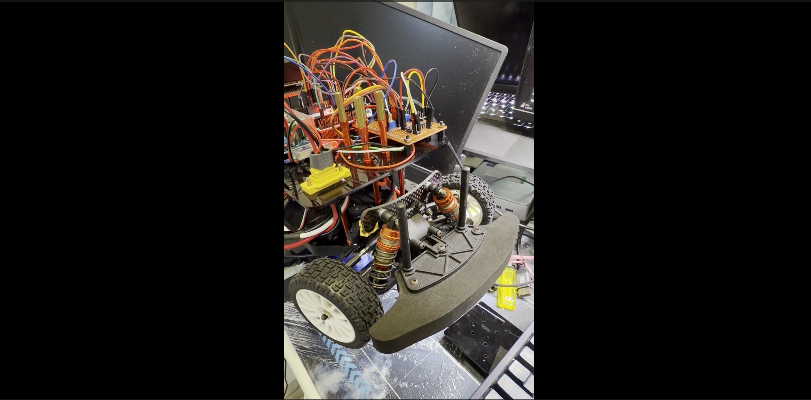
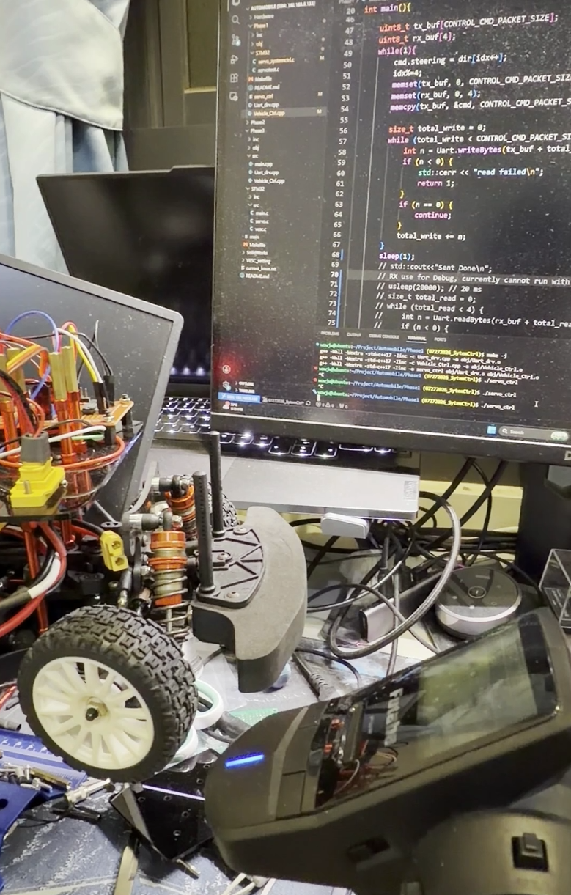

# Purpose
- Test 1: Control servo by sending PWM from STM32
- Test 2: Jetson sends PWM to STM32 using UART, and human could use transmitter to interrupt while Jetson is controling servo


## Test 1:
- For STM32 settings and explanation. See [STM config](../docs/STM32/README.md)
- Step:
1. Replace main.c with servotest.c (STM32)
2. Turn off power switch on your servor (Important: This step is important. If stm32 is setting PWM while loading firmware or rest stm32, the cut off PWM might result some unexpected large angle which might damage your chassis; otherwise, test before servo is being place on the chassis)
3. Turn on switch and run STM32
4. Should see servo oscillates between left and right

[](./Video/VehicleTest/ServoTest.mp4)
## Test 2:
- Step:
1. Replace `main.c` with `servo_systemctrl.c`.
2. Follow Test 1 steps 2–3.
3. Copy `Phase1` to your Jetson's repository.
4. Build and run:

   ```shell
   make
   ./servo_ctrl
   ```

5. Should see servo oscillates between left and right, and you cound take over the control when you use transmitter
6. Possible Issue: Servo jitter when human control due to high frequency changed value. This is fixed in Phase 3
[](../Video/VehicleTest/ServoInterrupt.mp4)


