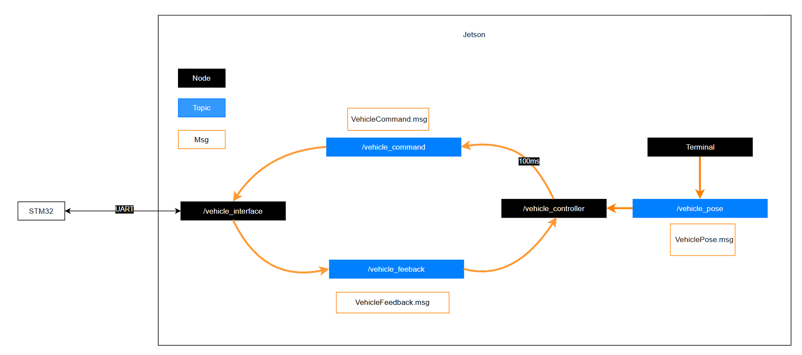

# Purpose:
Based on Phase 3 Jetson control and human interrupt.
Create node "vehicle_interface" to receive msg from node "vehicle_controller"

Create node "vehicle_controller" to send msg to node "vehicle_interface", receive feeback from node "vehicle_interface", and receive pose from terminal.
- Node Vehicle interface: The interface between controller and stm32,

# Software Architecture
- Node `vehicle_interface`:
  1. Enable uart peripheral and manage packet from STM32
  2. Handle command from node `vehicle_controller` and send it to STM32 at rate 10hz
  3. Receive feedback from STM32 and pass to node `vehicle_controller`
- Node `vehicle_controller`:
  1. Receive Feedback pass by node `vehicle_interface`
  2. Receive Pose command from the terminal and pass to node  `vehicle_interface` at rate 10hz
   


- Note about `VehiclePose.msg`:
```
# VehicleCommand.msg
int16  steering   
int16  throttle  
uint8  mode       
```
This is a temperorary work around for testing in Phase 4. 
The messsage will be modify to real pose such as position, velocity, acceleration, yaw, etc in the future. The conversion of pose to throttle and steering will also be added under the `Vehicle_Ctrl_Node.cpp` in the future.


# Step:
1. Open Terminal 1
2. Under Terminal 1
```shell
cd ros2_ws
source /opt/ros/humble/setup.bash
source install/setup.bash
colcon build --packages-up-to vehicle_controller
ros2 run vehicle_controller  vehicle_controller_node
```
3. Open Terminal 2
4. Under Terminal 2
```shell
cd ros2_ws
source /opt/ros/humble/setup.bash
source install/setup.bash
colcon build --packages-up-to vehicle_interface
ros2 run vehicle_interface  vehicle_interface_node
```
5. Open Terminal 3
6. Under Terminal 3
```shell
cd ros2_ws
source /opt/ros/humble/setup.bash
source install/setup.bash
# The following send different throttle and angle to node vehicle_controller at 10hz
ros2 topic pub /vehicle_pose vehicle_controller/msg/VehiclePose "{steering: 1520, throttle: 1000, mode: 1}" -r 10

ros2 topic pub /vehicle_pose vehicle_controller/msg/VehiclePose "{steering: 1520, throttle: 3000, mode: 1}" -r 10

ros2 topic pub /vehicle_pose vehicle_controller/msg/VehiclePose "{steering: 1650, throttle: 2500, mode: 1}" -r 10
```

# Useful Command
source /opt/ros/humble/setup.bash
source install/setup.bash
colcon build --packages-up-to {PACKAGE_TARGET}
ros2 run {PACKAGE_TARGET} {CMAKE_TARGET}
 
// Send msg from terminal
ros2 topic pub /vehicle_pose vehicle_controller/msg/VehiclePose "{steering: 1520, throttle: 0, mode: 1}" -r 10

ros2 topic pub /vehicle_pose vehicle_controller/msg/VehiclePose "{steering: 1520, throttle: 1000, mode: 1}" -r 10

ros2 topic pub /vehicle_pose vehicle_controller/msg/VehiclePose "{steering: 1520, throttle: 3000, mode: 1}" -r 10

ros2 topic pub /vehicle_pose vehicle_controller/msg/VehiclePose "{steering: 1650, throttle: 2500, mode: 1}" -r 10