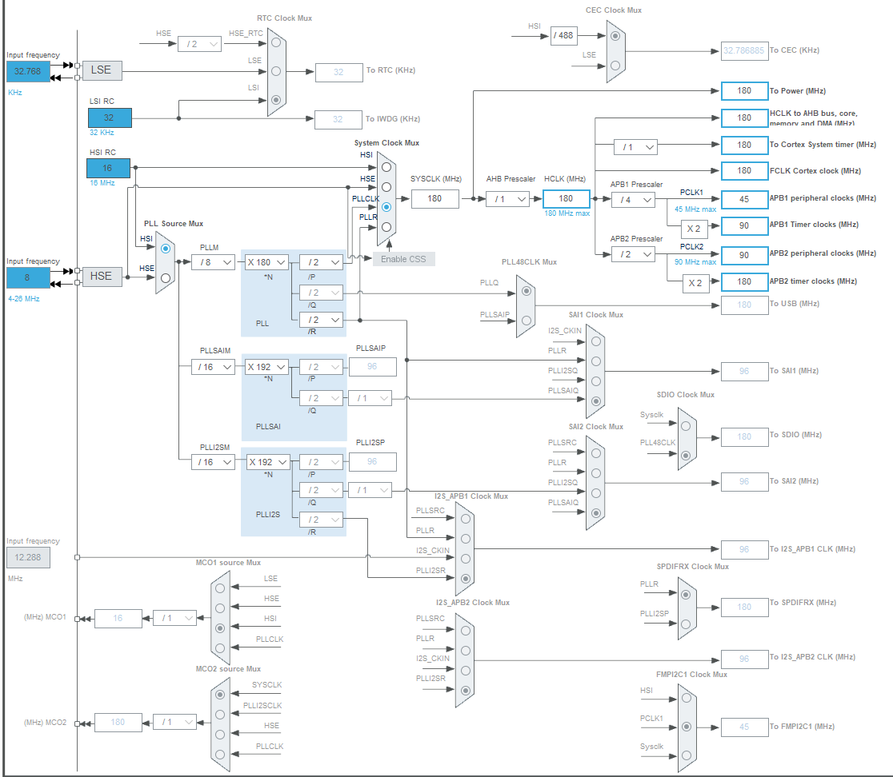
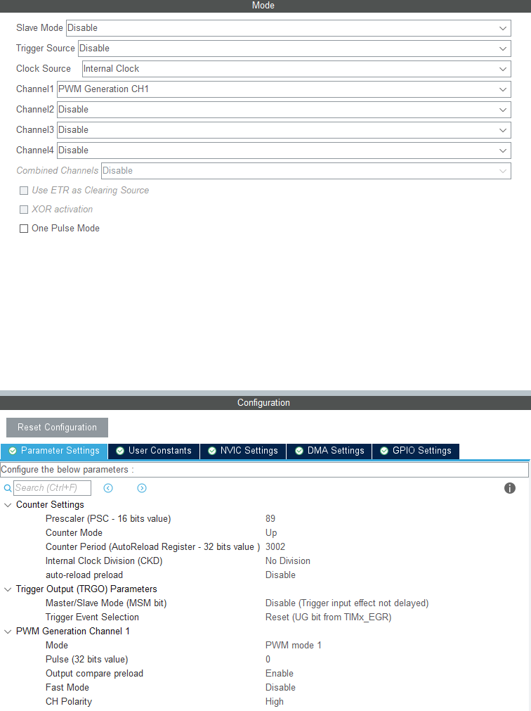
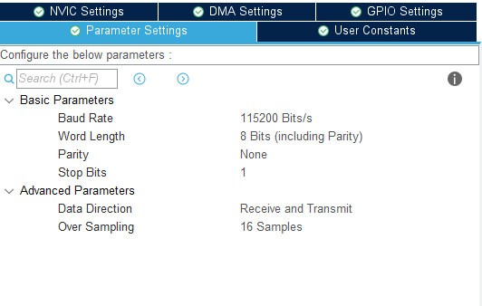
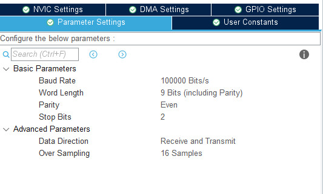
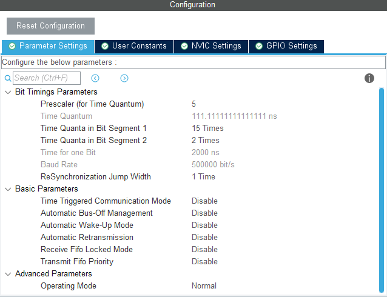
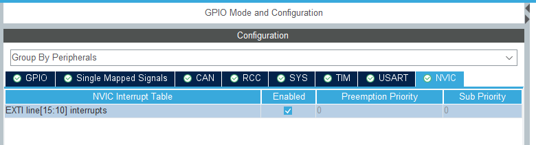

# STM32 Settings
## Section
- [Phase1: Servo & Jetson Command & Human Interrupt](#phase-1)
- [Phase2: Motor](#phase-2)
- [Phase3: Motor Feeback & System Integration](#phase-3)
### Phase 1
##### For PWM: Timer2 (PA0)
- CLOCK: HCLK->180MHZ

- CLOCK SOURCE: Internal
- CHANNEL1: PWM Generation CH1
- PRESCALER: 89
- Counter: 3002
My servo accept 333Hz PWM. For prescaler at 89, time counter is 1Mhz (90M/(89+1)), and 1 tick is 1us.
For 333Hz servo, one period is 3003us (1/333).
Hence, you need 3003 (3002+1) ticks  for current clock counter, resulting counter 3002

##### For Jetson: UART1 (PA9, PA10)
- Mode: Asynchronous
- DMA: RX On, Circular
- Baudrate: 115200
- Word bits: 8 bits
- Parity : None
- Stop bit: 1
- 

##### SUBS2: UART6 (PC6, PC7)
[SBUS2 protocol](https://github.com/Reefwing-Software/Reefwing-SBUS/blob/main/README.md)
- Mode: Asynchronous
- DMA: RX On, Circular
- Baudrate: 100000
- Word bits: 9 bits
- Parity : Even
- Stop bit: 2
- 

### Phase 2
##### CAN BUS: CAN1 (PB8, PB9)
- NVIC Interrupt: RX0 on
- BaudRate: 500k (matches VESC settings, see [VESC config](../Hardware/VESC_setting/README.md))
- Prescaler: 5
- Time Quanta Bit Seg1: 15
- Time Quanta Bit Seg2: 2

How this value is set:
Target baudrate 500k, and for CANS bus, a bit is build up by 1 sync TQ, Seg1 TQ, and Seg2 TQ. Hence, in my case, a bit is 18TQ (1 + 15 + 2). We want the clock to run a 9Mhz (9M TQ per second) since (18 * 500k). Therefore, prescaler need to set to 5 (45Mhz / 5). Why original clock source is 45Mhz can refer to the datasheet since the CAN1 is connect to APB1.

Potential Issue:
Above setting might be to strict for some case. You might want to change other settings below.

| Settings | Default | Actual  |
| :--- | :---: | :---: |
| BS1 | 15 | 13 |
| BS2 | 2 | 4 |
| SJW | 1 TQ | 4 TQ |
| Sample Point | 88.9 ((15+1)/18) | 77.8 ((13+1)/18) |
| Resync Margin | Smaller | Larger |

By setting BS2 to 4, you can set SJW up to 4 TQ so that controller may change the length of the current bit timing by  4 TQ during resynchronization, giving it more syncing margin.

- 

### Phase 3

##### Blue Button: GPIO (PC13)
- Enable PC13 with EXTI and enable NVIC
- 